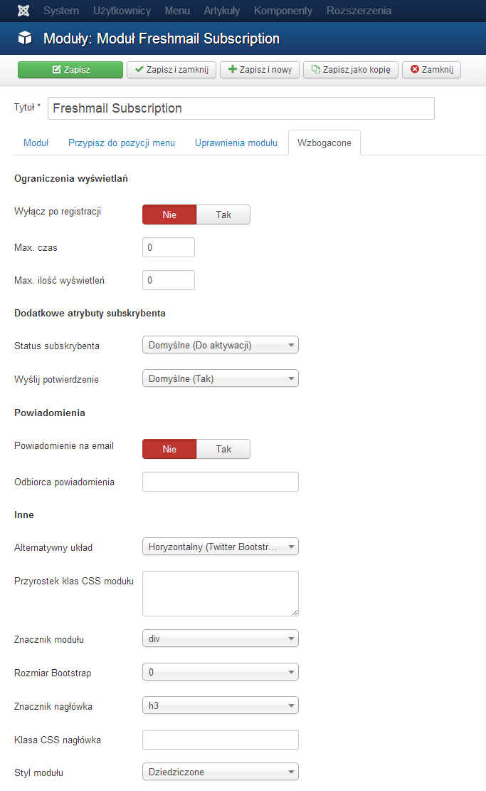

FreshMail Subscription 
======================

[Polska dokumentacja](https://github.com/piotr-cz/mod_freshmail2/blob/master/README.md)

Module for newsletter subscription in [Freshmail](http://freshmail.pl/) system


Functionality
-------------
- Custom fields management (Displaying, Required)
- New subscription notifications by email
- Option to use terms of service in form
- Layouts
 - Horizontal (Twitter Bootstrap 2.3)
 - Inline (Bootstrap 2.3)
 - Beez (Joomla 2.5)
 - Atomic (Joomla 2.5)
- Limit module Impressions or Duration or hide after registration
- Ajax (req. Joomla 3.1+)
- Subscription list selection


Requirements
------------

- Joomla 2.5+
- PHP 5.3
- Account in Freshmail system


Installation
------------

1. Download [latest release](https://github.com/piotr-cz/mod_freshmail2/releases) and install using Extension Manager _(Extensions > Extension Manager > Upload Package File)_.
2. Add module _(Extensions > Module Manager > New > Freshmail Subscription)_


Configuration
-------------

1. Enter Freshmail account **API Key (32 characters)** _(Options > API Key)_
2. Enter **API Secret (40 characters)** _(Options > API Secret)_
3. Select Subscribers list _(Options > Subscribers list)_

In freshmail.pl panel you may find API Key and API Secret in _Contact list > Parameters > API keys_ or in _Settings > Plugins and API > Your API keys_.


### Basic options


### Advanced options



### Layouts

**Vertical layout**


**Horizontal layout**


List selection layouts
----------------------

Default layout uses _checkbox_ type. To change to other, adjust code in layout to:

**Radio**

```php
<?php // Lists:Control ?>
<?php foreach ($lists as $i => $list) : ?>
	<label class="radio" title="<?php echo $list->description ?>">
		<input name="<?php echo $control ?>[list][]" type="radio" <?php if ($list->selected) : ?> checked="checked"<?php endif ?> value="<?php echo $list->subscriberListHash ?>" />
		<?php echo $list->name ?>
	</label>
<?php endforeach ?>
```

**Select**

```php
<?php // Lists:Control ?>
<select name="<?php echo $control ?>[list]" style="width: 100%">
<?php foreach ($lists as $i => $list) : ?>
	<option value="<?php echo $list->subscriberListHash ?>" <?php if ($list->selected) : ?> selected="selected"<?php endif ?>><?php echo $list->name ?></option>
<?php endforeach ?>
</select>
```

**Checkbox**

```php
<?php // Lists:Control ?>
<?php foreach ($lists as $i => $list) : ?>
	<label class="radio" title="<?php echo $list->description ?>">
		<input name="<?php echo $control ?>[list]" type="radio" <?php if ($list->selected) : ?> checked="checked"<?php endif ?> value="<?php echo $list->subscriberListHash ?>" />
		<?php echo $list->name ?>
	</label>
<?php endforeach ?>
```


Authors
-------

- [piotr_cz](https://github.com/piotr-cz)


Issues/ Feature requirements
----------------------------

[Submit issue or feature requirement here](https://github.com/piotr-cz/mod_freshmail2/issues)
