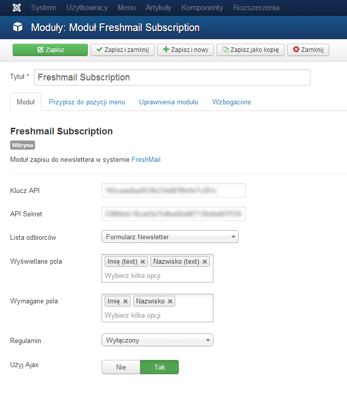
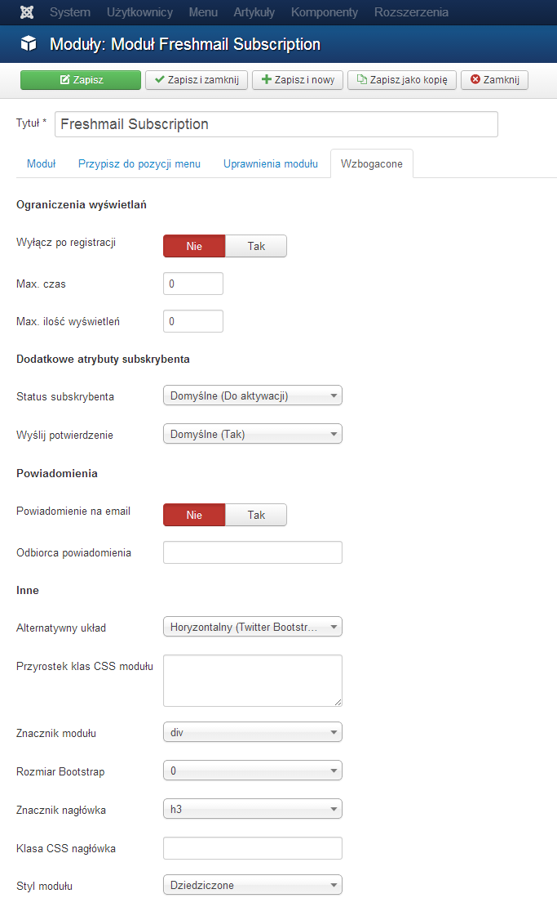
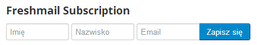
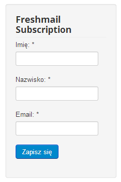

FreshMail Subscription 
======================

[English documentation](https://github.com/piotr-cz/mod_freshmail2/blob/master/README.en.md)

Moduł zapisu do newslettera w systemie [FreshMail](http://freshmail.pl/)


Funkcje
-------
- Zarządzanie  polami dodatkowymi (Wyświetlane, Wymagane)
- Powiadomienie o nowym subksrybencie na email
- Opcja odnośnika do regulaminu w formularzu
- Układy (layouty) do wyboru
 - Horyzontalny (Bootstrap 2 / 3)
 - Rzędowy (Bootstrap 2 / 3)
 - Beez (Joomla 2.5)
 - Atomic (Joomla 2.5)
- Ograniczenie liczby wyświetleń lub ukrycie modułu po registracji
- Ajax (wymagana Joomla 3.1+)
- Wybór listy subkrypcyjnej


Wymagania
---------

- Joomla 2.5+
- PHP 5.3
- Konto w systemie FreshMail


Instalacja
----------

1. Pobierz [najnowsze wydanie](https://github.com/piotr-cz/mod_freshmail2/releases) i zainstaluj za pomocą Instalatora Rozszerzeń Joomla _(Rozszerzenia > Instalacje > Instaluj z pakietu)_.
2. Dodaj moduł _(Rozszerzenia > Moduły > Utwórz > Freshmail Subscription)_


Konfiguracja
------------

1. Wstaw **Klucz API (32 znaków)** konta Freshmail _(Opcje > Klucz API)_
2. Wstaw **API Sekret (40 znaków)** _(Opcje > API Sekret)_
3. Wybierz Listę odbiorców _(Opcje > Lista odbiorców)_


W panelu freshmail.pl Klucz API oraz API Sekret znajddziesz w _liście odbiorców > Parametry > Klucze API_ lub w _Ustawienia > Wtyczki i API > Twoje klucze API_.


### Opcje podstawowe



### Opcje wzbogacone



### Układy

**Układ wertykalny**



**Układ Horyzontalny**




Układy wyboru listy
-------------------

Domyślny układ używa typu _checkox_. Aby zmienić na inny, zmień kod w układzie odpowiedzialny za wyświetlanie list:

**Radio**

```php
<?php // Lists:Control ?>
<?php foreach ($lists as $i => $list) : ?>
	<label class="radio" title="<?php echo $list->description ?>">
		<input name="<?php echo $control ?>[list][]" type="radio" <?php if ($list->selected) : ?> checked="checked"<?php endif ?> value="<?php echo $list->subscriberListHash ?>" />
		<?php echo $list->name ?>
	</label>
<?php endforeach ?>
```

**Select**

```php
<?php // Lists:Control ?>
<select name="<?php echo $control ?>[list]" style="width: 100%">
<?php foreach ($lists as $i => $list) : ?>
	<option value="<?php echo $list->subscriberListHash ?>" <?php if ($list->selected) : ?> selected="selected"<?php endif ?>><?php echo $list->name ?></option>
<?php endforeach ?>
</select>
```

**Checkbox**

```php
<?php // Lists:Control ?>
<?php foreach ($lists as $i => $list) : ?>
	<label class="radio" title="<?php echo $list->description ?>">
		<input name="<?php echo $control ?>[list]" type="radio" <?php if ($list->selected) : ?> checked="checked"<?php endif ?> value="<?php echo $list->subscriberListHash ?>" />
		<?php echo $list->name ?>
	</label>
<?php endforeach ?>
```


Własne szablony
---------------

Moduł komunikuje z użytkownikiem za pomocą wiadomości z wykorzystaniem 
[API Joomla](http://docs.joomla.org/Display_error_messages_and_notices).
W szablonie powinien więc znajdować się kod dla ich wyświetlania: 
`<jdoc:include type="message" />` jak np. w domyślnym szablonie Atomic.

Aby funkcjonalność AJAX działała we własnym szablonie, formularz powinien zawierać 
atrybut `data-freshmail2="<?php echo $control ?>"`.


Autorzy
-------

- [piotr_cz](https://github.com/piotr-cz)


Błędy/ Nowe funkcje
-------------------

[Zgłoś błąd lub propozycję nowej funkcji tutaj](https://github.com/piotr-cz/mod_freshmail2/issues)

[Najnowsza wersja developerska](https://github.com/piotr-cz/mod_freshmail2/archive/master.zip)
